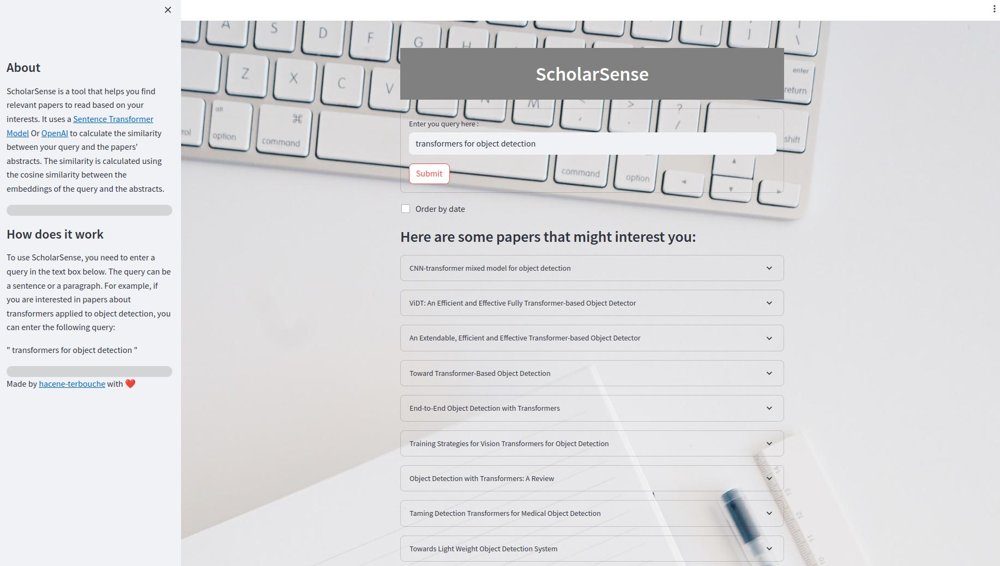
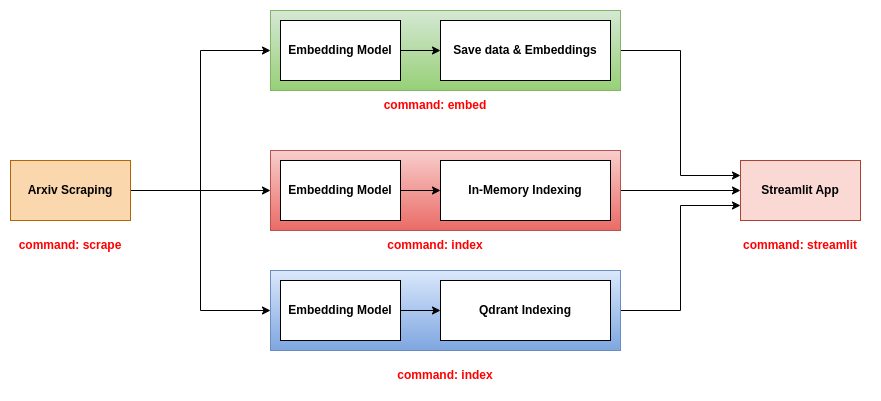

# ScholarSense: Build your Paper Recommendation System.


# Table of contents
- [What is ScholarSense](#what-is-scholarsense)
- [How does to install](#how-to-install)
- [How do to use it](#how-do-to-use-it)
- [ScholarSense Streamlit App](#scholarsense-streamlit-app)
- [Pipeline](#pipeline)
    - [Simple Backend](#simple-backend)
    - [In-memory Backend](#in-memory-backend)
    - [Qdrant Backend](#qdrant-backend)
- [ScholarSense CLI tool](#scholarsense-cli-tool)
    - [Scrape](#scrape)
    - [Embed](#embed)
    - [Index](#index)
    - [Streamlit](#streamlit)
- [References](#references)
# What is ScholarSense
ScholarSense is a tool that helps you find relevant papers to read based on your interests. It allows you to search for papers using a query. It uses a Language Model to embed the papers' information (title, abstract, etc.) into a vector space. Then, it indexes the papers' embeddings in a Vector database (In-memory or Qdrant).Finally, it uses the query to search for the most relevant papers in the database.


# How to install
To run ScholarSense locally, you need to install the virtual environment as well as all the dependencies using [poetry](https://python-poetry.org/) python package manager.
```
poetry install
```
To activate the virtual environment, you can run the following command:
```
poetry shell
```

To verify that the virtual environment is activated, you can import the package and print the version:
```
python -c "import scholarsense; print(scholarsense.__version__)"
```

# How do to use it
* After installing the package, you may need to create the structure of the folders. You can do that by running the following command:
    ```
    ./bash/create_dirs.sh
    ```
    It creates the following structure:
    ```
    .
    ├── artifacts
    │   ├── data
    │   │   ├── csv
    │   │   ├── json
    |   └── embeddings

    ```

* Then, you need to create a config file. You can use the [config.yaml](./config/config.yaml) file as a template. You can change the keywords to search for.


* This tool can be used in two ways:
    * using [ScholarSense CLI tool](#scholarsense-cli-tool) which is explained in the next section,
    * or using the scripts in the [scripts](./scripts) folder.

* You can run the scripts directly from the command line. For example, to scrape papers from Arxiv, you can run the following command:
    ```
    python scripts/run_scraping.py --config ./config/config.yaml --output_path ./artifacts/data/json --max_results 1000000
    ```

* You can also use the bash scripts in the [bash](./bash) folder. For example, to scrape papers from Arxiv, you can run the following command:
    ```
    ./bash/scrap.sh
    ```


# ScholarSense Streamlit App

The streamlit app is a web app that allows you to search for papers using a query. Inside the UI, you can enter a query in the text box and click on the "submit" button to get the results. You can also order the results by date. The results are displayed as an expandable list of papers. Each paper has a title, an abstract, and a link to the pdf file.




# Pipeline
This repo proposes three backends to use with the streamlit app:

## Simple Backend
This backend is the simplest one. It uses a csv file containing the papers' information and a pickle file containing the embeddings of the papers. The csv file contains the following columns:
- `title`: the title of the paper.
- `abstract`: the abstract of the paper.
- `pdf_url`: the url of the pdf file.
- `id`: the id of the paper.

The pickle file contains a numpy array of shape (N, D), where N is the number of papers and D is the dimension of the embeddings.

To use this backend, you should use the three commands `scrape`, `embed`, and `streamlit`. For more information about these commands, please refer to the [CLI tool](#scholarsense-cli-tool) section.


## In-memory Backend
This backend uses the json files containing the papers' information and index both the papers and the embeddings in an in-memory database. The index is saved as a .bin file. To use this backend, you should use the three commands `scrape`,  `index`, and `streamlit`. For more information about these commands, please refer to the [CLI tool](#scholarsense-cli-tool) section.


## Qdrant Backend
This backend uses the json files containing the papers' information and index both the papers and the embeddings in a Qdrant database. To use this backend, you should use the three commands `scrape`,  `index`, and `streamlit`. For more information about these commands, please refer to the [CLI tool](#scholarsense-cli-tool) section.

To run the Qdrant server, you can run the following command:
```
docker-compose up -d
```


# ScholarSense CLI tool
The simplest way to use ScholarSense is to use the CLI tool. You can run the following command to get the help message:
```
scholarsense --help
```

The CLI tool has foor commands:
- `scrape`: to scrape papers from Arxiv
- `embed`: to embed the papers using the Sentence Transformer model Or Open AI model
- `index`: to embed and index the papers using the a Vector database (In-memory or Qdrant)
- `streamlit`: to run the streamlit app and search for papers

## Scrape
To scrape papers from Arxiv, you can run the following command:
```
scholarsense scrape --help
```

The command takes the following arguments:
- `config`: the path to the yaml config file, containing the keywords to search for.
- `output_path`: the path to the output file, where the papers will be saved as json files.
- `max_results`: the maximum number of papers to scrape for each keyword, default is 1000000.

## Embed
This command is used to embed the papers using the Sentence Transformer model Or Open AI model.
It then saves the embeddings in a pickle file. To embed the papers, you can run the following command:
```
scholarsense embed --help
```

The command takes the following arguments:
- `input_path`: the path to the json file containing the papers.
- `output_path`: the path to the output file, where the papers will be saved as pickle files.
- `csv_file_path`: a path to a csv file, where the pepers's information will be saved.
- `model_type`: the type of the model to use, either `sentence-transformers` or `openai`, default is `sentence-transformers`.
- `model_name`: the name of the model to use of the chosen type, default is `all-MiniLM-L6-v2`.
- `encoding_method`: type of encoding method to use {title, abstract, concat, etc.}, default is `title`.

## Index
This command is used to embed and index the papers using the a Vector database (In-memory or Qdrant).
To embed and index the papers, you can run the following command:
```
scholarsense index --help
```

The command takes the following arguments:
- `db_path`: the path to json files containing the papers.
- `model_type`: the type of the model to use, either `sentence-transformers` or `openai`, default is `sentence-transformers`.
- `model_name`: the name of the model to use of the chosen type, default is `all-MiniLM-L6-v2`.
- `encoding_method`: type of encoding method to use {title, abstract, concat, etc.}, default is `title`.
- `indexing_method`: the method to use to index the papers, either `in-memory` or `qdrant`, default is `in-memory`.
- `host`: the host of the Qdrant server, default is None.
- `port`: the port of the Qdrant server, default is None.
- `collection_name`: the name of the collection to use in Qdrant, default is None.
- `index_file_path`: the path to the index file saved as .bin file for in-memory indexing, default is None.

## Streamlit
This command is used to run the streamlit app and search for papers.
To run the streamlit app, you can run the following command:
```
scholarsense streamlit --help
```

The command takes the following arguments:
- `backend`: the backend to use, either `simple`, `in-memory` or `qdrant`.
- `model_type`: the type of the model to use, either `sentence-transformers` or `openai`.
- `model_name`: the name of the model to use of the chosen type.
- `encoding_method`: type of encoding method to use {title, abstract, concat, etc.}.
- `limit`: the maximum number of papers to display.
- `collection_name`: the name of the collection to use in Qdrant.
- `csv_file_path`: a path to csv file containing the papers's information, useful if you're using simple backend.
- `embedding_file_path`: the path to the pickle file containing the embeddings, useful if you're using simple backend.
- `index_file_path`: the path to the index file saved as .bin file for in-memory indexing, useful if you're using in-memory backend.


# References
- [Arxiv API](https://info.arxiv.org/help/api/basics.html)
- [Sentence Transformer](https://www.sbert.net/index.html)
- [OpenAI Embedding](https://platform.openai.com/docs/guides/embeddings)
- [Qdrant](https://github.com/qdrant/qdrant)
- [Streamlit](https://streamlit.io/)
- [SPECTER](https://github.com/allenai/specter/tree/master)
